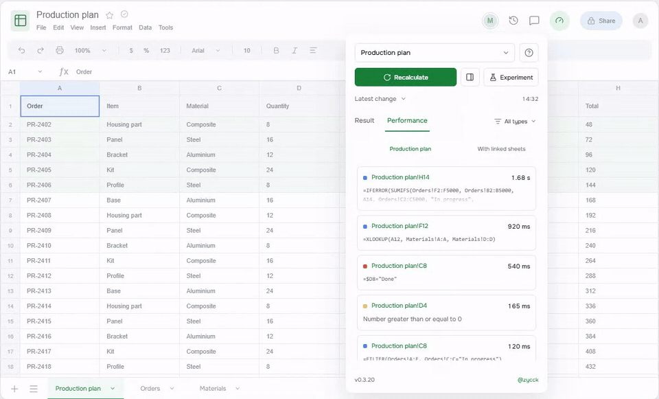
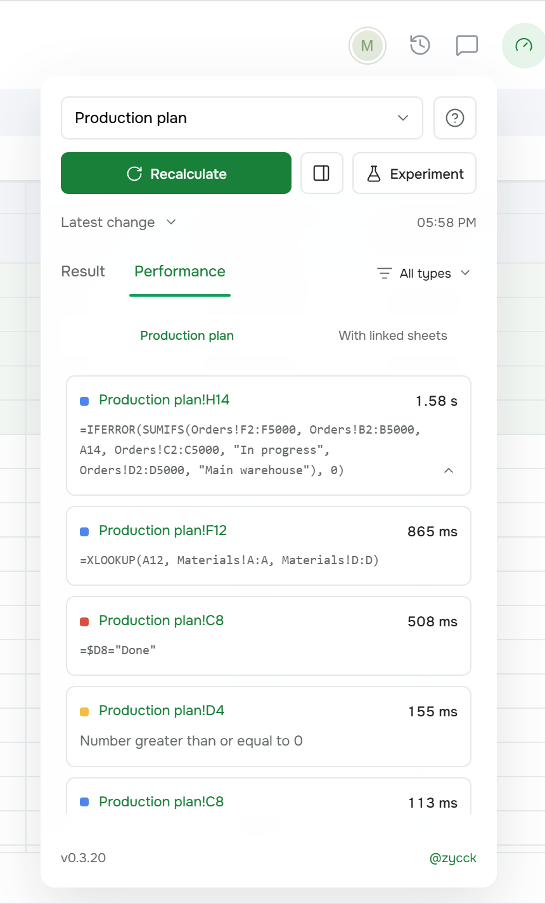
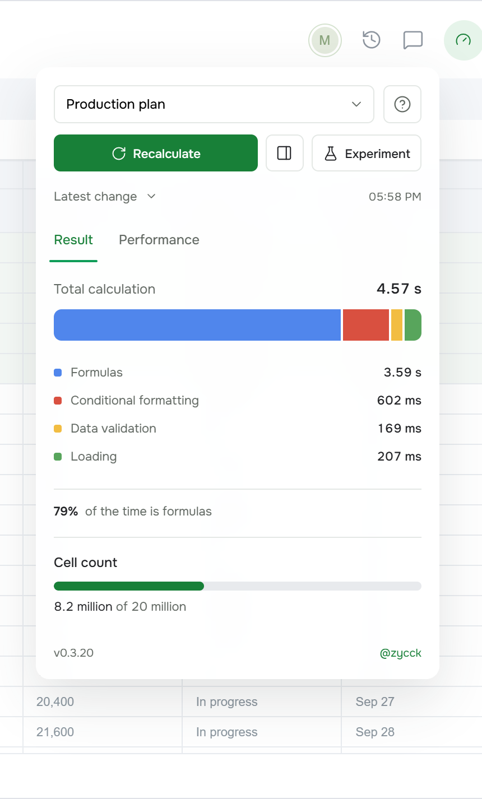
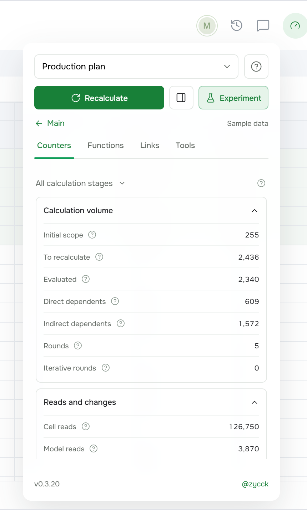

# Performance Panel for Google Sheets

**Descubra quais fórmulas deixam sua planilha lenta.**

[English](README.md) · [Русский](README.ru.md) · [Español](README.es.md) · [Deutsch](README.de.md) · Português · [Français](README.fr.md) · [Українська](README.uk.md) · [中文](README.zh.md) · [日本語](README.ja.md)

O Planilhas Google já mede quanto tempo cada fórmula leva, mas quase não mostra esses números. Este userscript adiciona um pequeno botão ao lado de "Compartilhar". Clique em "Recalculate" e veja primeiro as células mais lentas, cada uma com a fórmula, o tempo e um link que leva direto até ela.

## O que faz

- Recalcula a planilha inteira ou uma única página com o próprio mecanismo do Google.
- Lista as células mais lentas: fórmulas, formatação condicional e validação de dados.
- Clique em um endereço para ir até a célula.
- Mostra para onde foi o tempo: fórmulas, formatação, validação, carregamento.
- Aba Experiment: contadores do mecanismo, quantas vezes cada função rodou e os vínculos da célula selecionada.

  
  
  

## Instalação

1. Instale o [Violentmonkey](https://violentmonkey.github.io/) ou o [Tampermonkey](https://www.tampermonkey.net/).
2. Abra o script no [Greasy Fork](https://greasyfork.org/pt-BR/scripts/597075-performance-panel-for-google-sheets) e clique em Instalar.
3. Recarregue a planilha. O botão com o velocímetro aparece ao lado de "Compartilhar".

Funciona no Chrome e no Firefox. Se o Planilhas Google estiver em russo, o painel fica em russo; caso contrário, em inglês.

## Bom saber

- Todos os números vêm do Google. O script não estima nada e, quando o Google não informa algo, o painel avisa.
- Nada sai do seu navegador: sem servidores, sem analytics. Os resultados ficam na memória até você recarregar a página.
- Recalcular uma página pode recalcular também as páginas das quais ela depende.
- O Google muda o Planilhas com frequência. Se algo em que o script se apoia mudar, você verá uma mensagem clara em vez de números errados.
- Sem vínculo com o Google.

A demonstração usa dados de exemplo. Este repositório contém apenas o script pronto; o Greasy Fork se atualiza a partir dele automaticamente.

Feito por [@zycck](https://t.me/zycck).
